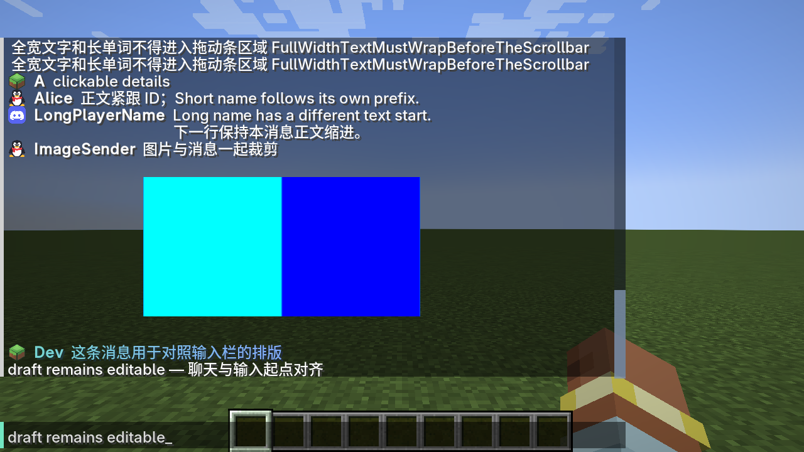

# MineAstr 聊天系统 0.7.38

MineAstr 替换原版 `ChatComponent.render` 的整个绘制循环，并在打开原版 `ChatScreen` 时替换为 `MineAstrChatScreen`。消息排版、视口绘制、输入栏外观、滚轮、滑块和命中检测由 MineAstr 管理。原生 `EditBox` 和命令补全继续负责输入，保留输入法、聊天草稿、历史、快捷键、链接、悬停，以及消息签名和删除接口。其他模组自定义的聊天 Screen 不被强制覆盖，底层聊天视口仍使用 MineAstr。

## 消息布局

玩家消息按 `平台图标 玩家ID 正文` 排列。正文起点由该条消息的实际 ID 宽度计算，没有固定昵称列。换行正文和图片沿用该条正文缩进。MC 原生玩家消息、QQ 和 Discord 转发使用同一规则；只有超长 ID 才会截断以保留正文空间。系统消息没有玩家身份时保留其原有组件内容。

## 滚动与裁剪

- 聊天、F8 设置共用连续像素滚动模型；结束位置不会转换成整数行。
- 聊天正常滚轮每单位移动 2.5 行，Shift + 滚轮移动 0.5 行；触控板小增量会累积。
- 聊天右侧纵向滑块可以直接拖动，也可点击轨道跳转；抓住滑块不会改变鼠标与滑块的相对位置。拖出轨道会限制在端点，释放鼠标结束拖动。
- 消息文字、图片及设置控件只绘制与视口相交的部分，不必整条或整个控件进入视口。控件隐藏部分不接收点击。
- F8 控件的拖动、焦点与键盘操作保留；键盘定位到视口外的控件会滚入可见区域。底部保存/撤销/取消固定显示。
- 浏览旧聊天时，新消息增加相应像素偏移以保留阅读位置。历史限制为 100 条完整消息，并设置 4096 显示行的额外上限，图片/多行消息也受约束。

F8 中的聊天动画、滚动时长、入场时长、图片比例和聊天高度设置继续生效。关闭动画仍使用连续位置。内联图片/GIF 沿用有界异步下载和解码，不在聊天渲染线程执行网络或图像解码。

## 日志与兼容

实际进入聊天绘制时记录一次：

```text
MineAstr chat system active: renderer=MineAstr continuous_scroll=true draggable_scrollbar=true layout=icon_sender_body
```

原有 `[System] [CHAT]` 是消息接收/存储日志，并不表示原版绘制循环仍在工作。UI 接管不会自行改变服务器发来的消息签名；开启原生翻译时的未签名重发行为沿用既有桥接策略。

客户端 0.7.38 兼容服务端 0.7.31 和插件 0.7.32，协议仍为 1，没有新增 Minecraft 模组。完全退出游戏再启动才能加载新版 JAR。

## 验证范围

89 项 JUnit 测试及构建通过。隔离的 Minecraft 1.21.1 / NeoForge 21.1.219 客户端分别使用原版字体及 ModernUI 3.13.0.1；后者另用现有客户端的 ModernUI 设置验证。实际检查聊天替换、草稿、正文起点、链接命中、图片纹理、滚动结束的分数位置、滑块抓取/拖动/释放、设置边缘裁剪及隐藏区点击。未声称覆盖整套整合包的所有其他模组界面。

## 输入栏与命令提示 0.7.38

输入栏只保留可编辑内容，不显示 MC 图标或玩家 ID。文字起点与上方聊天区域对齐。显示消息的图标 + 玩家 ID + 正文布局不变。原版编辑框及提示窗口使用原生 GUI 坐标和字号，聊天显示缩放不会改变命令编辑及提示的坐标。

保留 ChatScreen 原本创建的 EditBox 和 CommandSuggestions 对象，后者绑定真实 ChatScreen。原版输入法、草稿、历史、Tab 补全、建议点击及滚轮、参数用法和语法错误标记继续工作；提示窗口优先处理点击，避免被滑块截获。

右侧聊天滑块位于聊天背景内，预留独立留白，不覆盖文字和图片；聊天宽度在窄窗口中按可用空间收缩。连续像素滚动和可拖动滑块保留。每张 GIF 仅在实际绘制时推进计时及纹理更新；滚出可见范围或关闭聊天框后冻结当前帧，再次显示从暂停处继续。聊天多行及悬停预览在同一渲染帧共用一次更新。大图查看器中可见的 GIF 正常播放。



## 上下对齐与滑块留白 0.7.38

聊天区与输入栏共用 ChatPanel：竖线位于同一列，宽度相同，文字也有相同起点。竖线是固定边界，独立于原版输入光标。原版编辑框、输入法、补全及命令提示保留。

滑块位于背景内部的独立留白，与正文之间保留间隔；正文换行和图片尺寸使用同一内容宽度。文字、图片及对应鼠标命中止于正文右边界，不能被滑块遮挡或在留白处截获点击。聊天缩放与窗口改变时统一重新布局。

## 左右贴边 0.7.38

上下竖线位于屏幕最左端，没有左侧空隙，宽度统一为 2 个 GUI 像素，参考旧版粗线。滑块右侧与聊天背景边缘重合，没有条外留白；正文与滑块之间的独立留白保留，条外点击不会捕获拖动。
